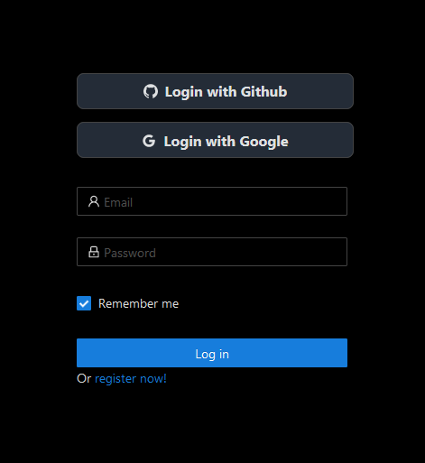
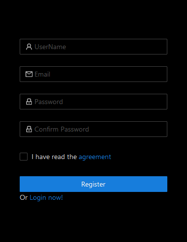
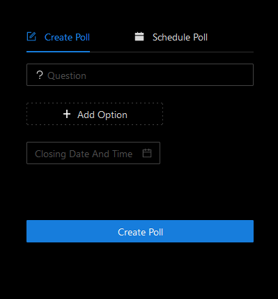
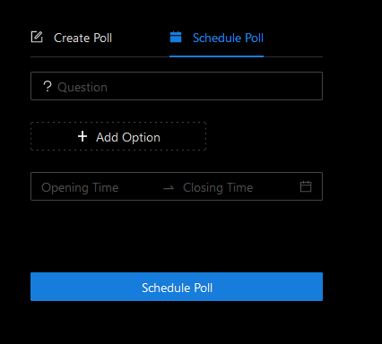
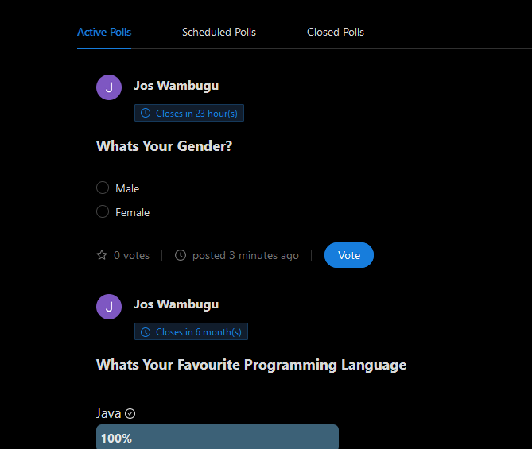
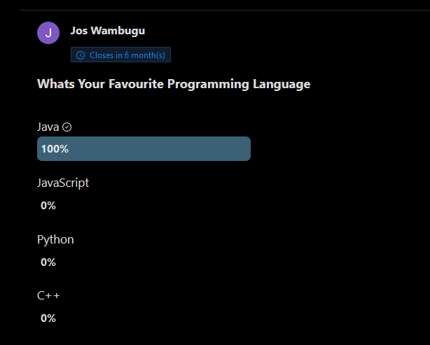
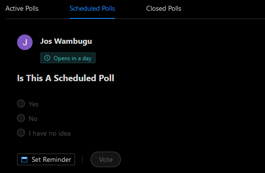

<!-- PROJECT LOGO -->
<br />
<p align="center">
  <a href="https://github.com/wambugucoder/FINAL-YEAR-PROJECT">
    
  </a>

  <h1 align="center">Polling Application</h1>

  <p align="center">
    An Easier And Better Way To Create Polls,
    Schedule Polls and Vote For What Seems Best
    <br />
    <a href="https://github.com/wambugucoder/FINAL-YEAR-PROJECT/blob/main/README.md"><strong>Explore the docs »</strong></a>
    <br />
    <br />
    <a href="https://poll-app.tech">View Demo</a>
    ·
    <a href="https://github.com/wambugucoder/FINAL-YEAR-PROJECT/issues/new">Report Bug</a>
    ·
    <a href="https://github.com/wambugucoder/FINAL-YEAR-PROJECT/issues/new">Request Feature</a>
  </p>
</p>

<!-- TABLE OF CONTENTS -->
<details open="open">
  <summary>Table of Contents</summary>
  <ol>
    <li>
      <a href="#about-the-project">About The Project</a>
      <ul>
        <li><a href="#built-with">Built With</a></li>
      </ul>
    </li>
    <li>
      <a href="#getting-started">Getting Started</a>
      <ul>
        <li><a href="#prerequisites">Prerequisites</a></li>
        <li><a href="#installation">Installation</a></li>
      </ul>
    </li>
    <li><a href="#usage">Usage</a></li>
    <li><a href="#roadmap">Roadmap</a></li>
    <li><a href="#contributing">Contributing</a></li>
    <li><a href="#license">License</a></li>
    <li><a href="#contact">Contact</a></li>
    <li><a href="#acknowledgements">Acknowledgements</a></li>
  </ol>
</details>

<!-- ABOUT THE PROJECT -->

## About The Project

The Project involves collecting data from users which may be useful in research.
In this project:

- 🌟 Users no longer have to worry about the long registration process as they
  can just login directly from their google and github accounts.

- 🌟 Users can be able to schedule polls at any moment of their choice and
  within that time frame the poll wll be open to the public.
- 🌟 Users cannot post disturbing content as all polls are subjected to a
  sentiment review before being posted.

- 🌟 Users have the freedom to vote in as many polls as they want as long as the
  polls are still open for voting .

⚠️⚠️ Due to the difference in timezones and the requirement for a specific time
in scheduling a poll, A GeoIp configuration was set in the production server to
only host users within Kenya.

<b>A later Update will soon have all countries included.</b>

### Built With

The Web App was Built using the following technologies and frameworks :

- [SpringBoot](https://spring.io/projects/spring-boot)
- [Reactjs](https://reactjs.org/)
- [Ant Design](https://ant.design/)

<!-- GETTING STARTED -->

## Getting Started

To get a local copy up and running follow these simple example steps.

### Prerequisites

Make sure you've got <a href="https://maven.apache.org/install.html">Maven
</a>and <a href="https://nodejs.org/en/download/">Nodejs</a> installed on your
computer.

Once NodeJs is installed,get the latest npm version.

- npm
  ```sh
  npm install npm@latest -g
  ```

### Installation

1. Clone the repo
   ```sh
   git clone https://github.com/wambugucoder/FINAL-YEAR-PROJECT.git
   ```
2. Install NPM packages in the client folder
   ```sh
   npm install
   ```
3. In the server folder,perform a maven install and skip tests.

   ```sh
   mvn install -DskipTests
   ```

<!-- USAGE EXAMPLES -->

## Usage

</img>

</img>

</img>

</img>

</img>

</img>

/img>

<!-- ROADMAP -->

## Roadmap

See the [open issues](https://github.com/wambugucoder/FINAL-YEAR-PROJECT/issues)
for a list of proposed features (and known issues).

<!-- CONTRIBUTING -->

## Contributing

Contributions are what make the open source community such an amazing place to
be learn, inspire, and create. Any contributions you make are **greatly
appreciated**.

1. Fork the Project
2. Create your Feature Branch (`git checkout -b feature/AmazingFeature`)
3. Commit your Changes (`git commit -m 'Add some AmazingFeature'`)
4. Push to the Branch (`git push origin feature/AmazingFeature`)
5. Open a Pull Request

<!-- LICENSE -->

## License

Distributed under the MIT License. See `LICENSE` for more information.

<!-- CONTACT -->

## Contact

JosWambugu - [@JosWambugu](https://twitter.com/JosWambugu) -
josphatwambugu77@gmail.com
